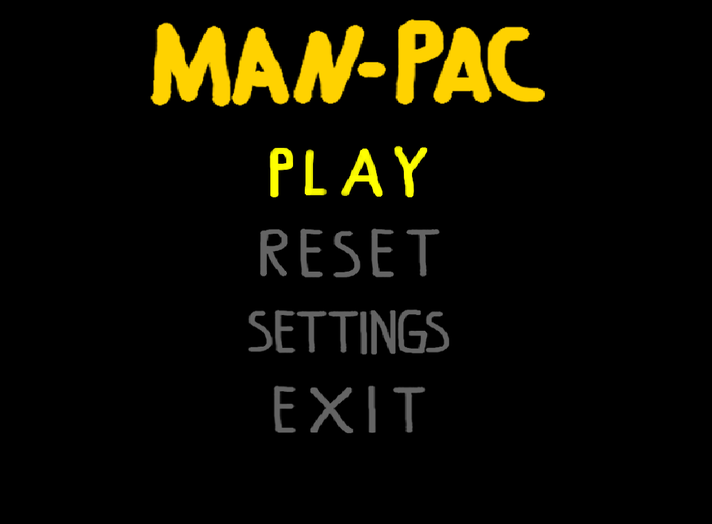
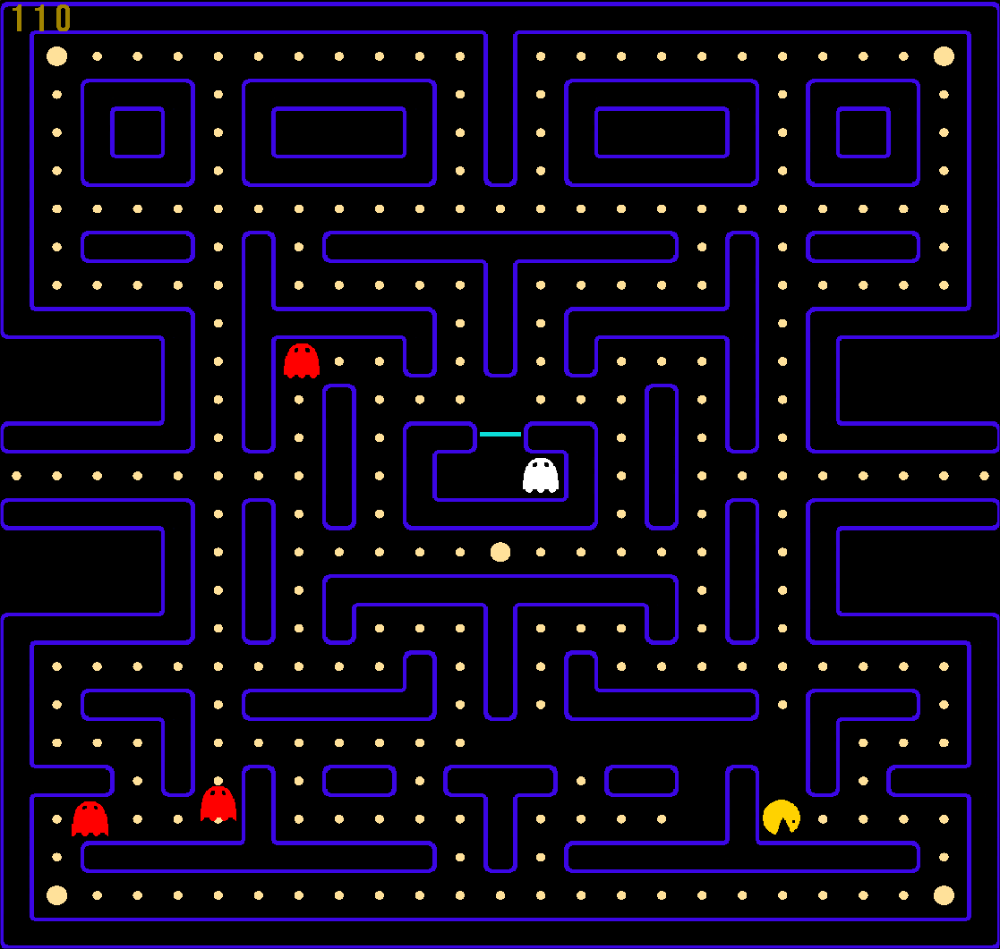

# Pac-Man Game (Educational Project)

## Overview
This is a Pac-Man-inspired game developed as part of an educational process to learn about game programming, multithreading, and synchronization using semaphores and mutexes. The game features a player navigating a maze, collecting points, and avoiding enemies while adhering to thread-safe operations for shared data.

The game is implemented using **SFML (Simple and Fast Multimedia Library)**, leveraging its robust graphics and multimedia capabilities.




---

## Features
- **Maze Gameplay**: Navigate through a pre-defined maze layout and collect points.
- **Enemies with AI**: Avoid dynamically spawning enemies with randomized attributes such as position and color.
- **Boost Mechanics**: Collect boosts to gain temporary invincibility and multiply points.
- **Score Tracking**: Displays a real-time score on the screen.
- **Threaded Logic**: Uses multithreading to handle game logic, including enemy spawning and interaction.
- **Secure Data Handling**: Employs mutexes to synchronize access to shared data like enemies and points.

---

## Game Mechanics
- **Player**: The player can move around the maze, collect points, and gain boosts.
- **Enemies**:
  - Randomized colors and positions.
  - Chases the player based on game logic.
  - Defeated enemies grant bonus points.
- **Boosts**: Temporarily make the player invincible, allowing them to defeat enemies without harm.
- **Maze**: Pre-defined maze layout with walls, paths, and spawn points for the player, enemies, and boosts.

---

## Technologies Used
- **C++**: Core language used for game logic and implementation.
- **SFML**: Handles graphics, window management, and input.
- **Multithreading**: Utilizes `std::thread` and synchronization primitives (`std::mutex`, `std::unique_lock`) for secure concurrent operations.
- **JSON**: Map data stored in JSON format for flexible level design.

---

## Controls
- **Arrow Keys**: Move the player.
- **F5**: Reset the game.
- **Esc or X**: Exit the game.

---

## How to Build and Run
### Requirements
- **C++ Compiler**: Supporting C++11 or later.
- **SFML**: Installed on your system.

### Build Instructions
1. Clone the repository:
   ```bash
   git clone https://github.com/Dogfetus/man-pac.git
   cd pacman-game
   ```
2. Create a build directory and navigate to it:
   ```bash
   mkdir build && cd build
   ```
3. Run `cmake` to configure the project:
   ```bash
   cmake ..
   ```
4. Build the project using `make`:
   ```bash
   make
   cd ..
   ```
5. Run the game:
   ```bash
   ./build/Game
   ```

---

## Educational Insights
- **Multithreading**: Implemented a separate thread to handle game functions like enemy spawning and interactions, synchronized using mutexes.
- **SFML Graphics**: Learned to create and manage graphical elements like sprites, textures, and animations.
- **Game Design**: Developed skills in map design, game balancing, and feature implementation.

---

## Contributing
This project was developed for educational purposes. Contributions and suggestions are welcome to enhance its features or improve its codebase.


